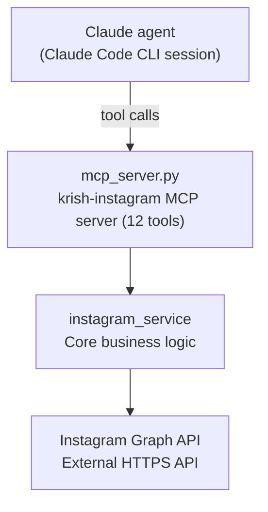

# Architecture

This document describes how the project is put together: the stack, the
module breakdown, and how a request flows from a Claude conversation
through to the Instagram Graph API and back.

## Tech stack

| Layer | Choice | Why |
|---|---|---|
| Language | Python 3.12 | |
| HTTP client | `requests` | Talks to the Instagram Graph API |
| MCP server | Python MCP SDK (`FastMCP`, pinned to `mcp==1.30.0`) | Exposes `instagram_service` as tools a Claude agent can call |
| Config/secrets | `python-dotenv` + a `.env` file | Keeps the access token out of source code |
| Testing | `pytest` + `responses` | `responses` mocks the Graph API's HTTP layer so tests run with no real token or network access |

`mcp` is pinned to the 1.x line deliberately: `mcp` 2.x renamed `FastMCP`
to `MCPServer` with a different API, and `mcp_server.py` uses the classic
`FastMCP` decorator style.

Nothing here needs installing beyond `pip install -r requirements.txt` —
there's no database, no web server, no build step.

## Project structure

```
instagram_project/
├── instagram_service/          # Core library — all Graph API logic
│   ├── config.py               #   API host/version, env-based settings
│   ├── exceptions.py           #   Typed errors parsed from Graph API responses
│   ├── client.py                #   Shared HTTP call wrapper (retries, pagination, error parsing)
│   ├── auth.py                  #   Token exchange/refresh (Instagram Login flow)
│   ├── media.py                 #   Media list/details functions
│   ├── comments.py              #   Comment read/reply/moderate functions
│   ├── insights.py              #   Account + media insights functions
│   ├── publishing.py            #   Media container creation + publish + quota check
│   ├── messaging.py             #   DM conversations/messages/send + messaging-window guard
│   ├── smoke_test.py            #   Manual script to test read-only calls against your real account
│   ├── diagnose_env.py          #   Diagnoses .env loading issues
│   └── .env                     #   Your secrets (not committed to git)
│
├── mcp_server.py                # The MCP server (registered as `krish-instagram`) — wraps
│                                 # instagram_service as 12 tools for a Claude agent
│
├── .claude/skills/instagram-mcp-workflow/SKILL.md
│                                 # Workflow rules Claude follows when using the tools:
│                                 # confirmation-before-publish, caption/DM conventions, etc.
│
├── tests/                        # pytest suite — mocks the Graph API and the MCP tool layer
│
├── requirements.txt              # Runtime dependencies
└── requirements-dev.txt          # Test-only dependencies
```

## Component responsibilities

**`client.py`** is the choke point every other module goes through — it
injects the base URL and access token, retries on rate limits with
exponential backoff, follows pagination cursors, and turns Graph API error
JSON into typed Python exceptions. Nothing else in the codebase calls
`requests` directly.

**`auth.py`** handles the Instagram Login token lifecycle: exchanging a
short-lived token for a long-lived one, and refreshing before expiry.

**`media.py` / `comments.py` / `insights.py`** are thin, single-purpose
wrappers over specific Graph API read/write endpoints — one function per
operation (list media, get one post's details, list/reply to/hide/delete
comments, get account insights, etc).

**`publishing.py`** implements the two-step Instagram publish flow: create
a media container (`create_media_container`), poll it until ready
(`wait_for_container_ready`), then publish it (`publish_container`).
`get_publishing_limit` checks the rolling 24h quota before attempting a
publish.

**`messaging.py`** wraps the Instagram Messaging API: listing
conversations, reading messages, and sending replies. `send_message` calls
`is_within_messaging_window` internally and raises before ever hitting the
API if the 24h reply window has closed.

**`mcp_server.py`** is intentionally thin — each tool just calls into
`instagram_service` and returns the JSON response (or a flattened dict for
`get_media_insights`). No business logic lives in this layer; the only
thing added here is the preview/publish split for posts
(`preview_post`/`publish_post`) so a container can be built and inspected
before anything actually goes live.

## Architecture diagram



## Data flow: a read (e.g. "show me my recent posts")

1. Claude calls the `list_media` MCP tool.
2. `mcp_server.py` calls `instagram_service.media.get_media(...)`.
3. `media.py` calls `client.call_graph_api(...)`, which hits
   `graph.instagram.com` with the access token.
4. The JSON response is returned straight back to Claude, which formats it
   for the user. Nothing is stored locally.

## Data flow: a write (e.g. "post this image with caption X")

1. Claude calls `preview_post` — this builds a media container via
   `publishing.create_media_container` and polls it with
   `wait_for_container_ready` until Meta reports it `FINISHED`. Nothing is
   public yet.
2. Claude shows the user the actual image and the caption, quoted
   verbatim, and waits for explicit go-ahead (enforced by the
   `instagram-mcp-workflow` skill, not by the server itself).
3. Only once approved does Claude call `publish_post`, which calls
   `publishing.publish_container` — this is the one call that makes the
   post public.

The same show-then-confirm pattern applies to `reply_to_comment`,
`delete_comment`, and `send_message_reply`.

## Testing approach

The pytest suite uses the `responses` library to intercept outbound HTTP
calls at the point `requests` would normally fire, so it runs with **no
real access token and no network access**. `tests/test_mcp_server.py` goes
one level up: it calls tools through `mcp.call_tool(...)` — the same path
a real MCP client uses — rather than calling the wrapped Python functions
directly, so it also verifies FastMCP's exception-wrapping behavior
(`ToolError("Error executing tool <name>: <message>")`) produces sensible
messages for each of this project's typed exceptions. Real-account testing
is a separate, deliberate step via `smoke_test.py` (read-only) or actually
using the tools in a Claude session.

## Notable design decisions

- **No local database** — this project used to also maintain a SQLite
  history and a Flask dashboard for browsing it; both were removed once
  the project's scope narrowed to MCP-only. Everything now is a live call
  to the Graph API, nothing is persisted locally.
- **Preview/commit split for publishing** — `preview_post` never
  publishes anything on its own, so it's safe for Claude to call freely
  while building context; only `publish_post` is irreversible.
- **Confirmation is a skill concern, not a server concern** — `mcp_server.py`
  has no built-in "are you sure?" prompt; that logic lives entirely in the
  `instagram-mcp-workflow` skill, which governs how Claude uses the tools
  rather than the tools' own implementation.
